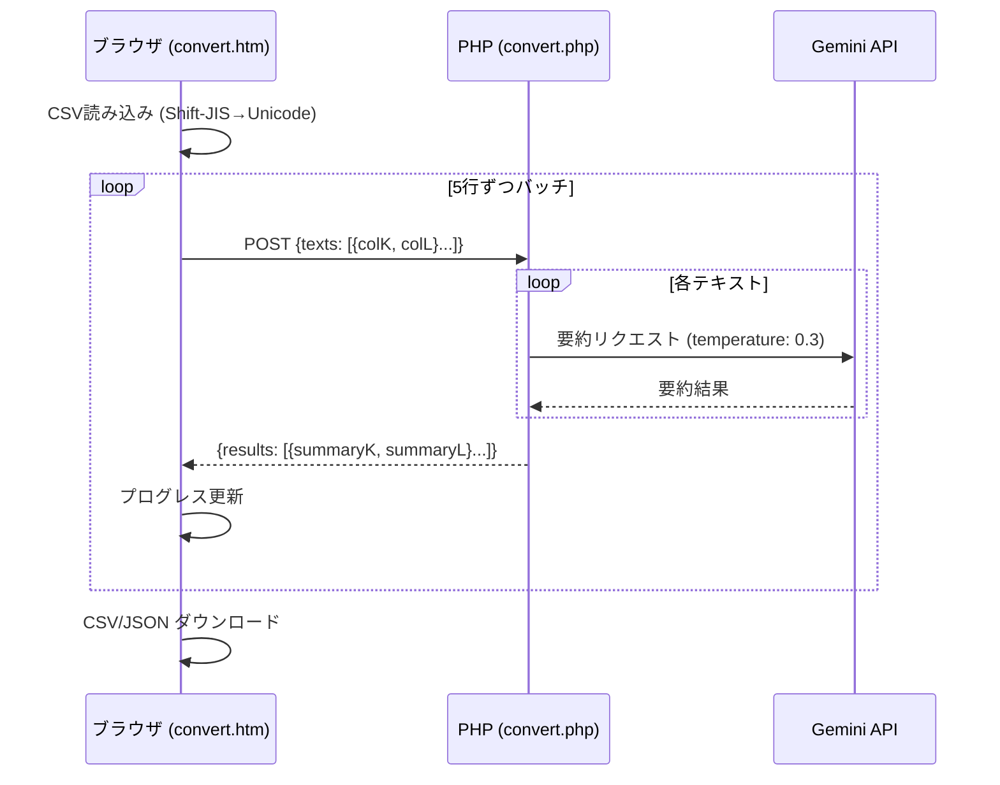

# 阪急ランドオペレーター CSVコンバーター

（CSV）K列→M列、L列→N列に要約抽出するコンバーター

## 概要

旅行業務で使用されるCSVファイルのK列（確認手配事項内容）とL列（後方メモ）を、Google Gemini APIを使用して要約し、M列とN列に出力するWebアプリケーションです。

## ファイル構成

| ファイル | 役割 |
|---------|------|
| `.env` | Gemini APIキー設定 |
| `convert.php` | Gemini APIプロキシ（バッチ要約処理） |
| `convert.htm` | フロントエンドUI |

## アーキテクチャ



## 主な機能

- **CSV要約変換**: K列・L列のテキストをAIで要約してM列・N列に追加
- **Shift-JIS対応**: `encoding.js`ライブラリで自動エンコーディング検出・変換
- **5行バッチ並列処理**: 1回のPOSTで5行分を同時に要約
- **リアルタイムプログレス**: 「52行中25行処理完了 - 48%」形式で表示
- **エラーリトライ**: 503/429エラー時に指数バックオフ（2s, 4s, 8s）で最大3回リトライ
- **2種類のダウンロード**: Shift-JIS CSV & courses配列形式のJSON

## 技術スタック

- **AI**: Google Gemini 3 Flash Preview（temperature: 0.3, maxOutputTokens: 1000）
- **バックエンド**: PHP（cURL）
- **フロントエンド**: HTML / CSS / Vanilla JavaScript
- **文字コード変換**: encoding.js（CDN）

## Gemini API プロンプト

以下のプロンプトをGemini APIに送信して要約を生成します：

```
以下の旅行業務テキストを、下記のルールに従って要約してください。

【要約ルール】
1. 必ず記載する項目：
   - 「アレルギー」「車椅子での参加」「医療機器」など具体的支援ニーズ
   - お客からの要望（RQ）
   - 特別依頼：「ハネムーン」「結婚記念日」

2. 削除する項目：
   - 一般的な持参薬案内
   - 確定（HK）や変更履歴（例：TWN SGL→）
   - 金銭/保険/旅券/連絡先変更/JR/社内進行
   - 「☆☆ダミー記録です☆☆」のようなプレフィックス

3. 出力形式：
   - 簡潔にまとめる（最大80文字以内）
   - 重要な情報のみを抽出
   - 必ず完結した文章で出力する（途中で切れないように注意）
   - 何も記載すべき内容がない場合は、何も出力せずに空白のままにする

テキスト：
${対象テキスト}

要約：
```

### プロンプトパラメータ

| パラメータ | 値 | 説明 |
|-----------|-----|------|
| モデル | `gemini-3-flash-preview` | 最新のFlashモデル |
| temperature | `0.3` | 一貫性を重視 |
| maxOutputTokens | `1000` | 要約が途中で切れないよう十分な長さ |
| タイムアウト | `30000ms` | 30秒 |
| リトライ | 最大3回 | 503エラー時は指数バックオフ: 2s, 4s, 8s |

## 環境変数（.env）

```
GEMINI_API_KEY=あなたのGemini APIキー
```

## 起動方法

```bash
# PHPビルトインサーバー
php -S localhost:3000

# またはXAMPPのhtdocsに配置
```

ブラウザで `http://localhost:3000/convert.htm` を開く。

## 使用方法

1. **CSVファイルのアップロード**: ドラッグ&ドロップまたはクリックで選択
2. **データを変換**: ボタンクリックで要約処理を開始
3. **プログレス確認**: リアルタイムで処理状況を表示
4. **ダウンロード**:
   - 「再度、CSVで出力」→ Shift-JIS CSVファイル
   - 「阪急JSON形式で出力」→ courses配列形式のJSON

## JSON出力形式

```json
{
  "courses": [
    {
      "問合せ番号": "TEST001",
      "確認手配事項内容": "エビとカニのアレルギーがあります",
      "後方メモ": "車椅子での参加",
      "AI要約済_確認手配事項内容": "エビ、カニのアレルギーあり",
      "AI要約済_後方メモ": "車椅子で参加"
    }
  ]
}
```
